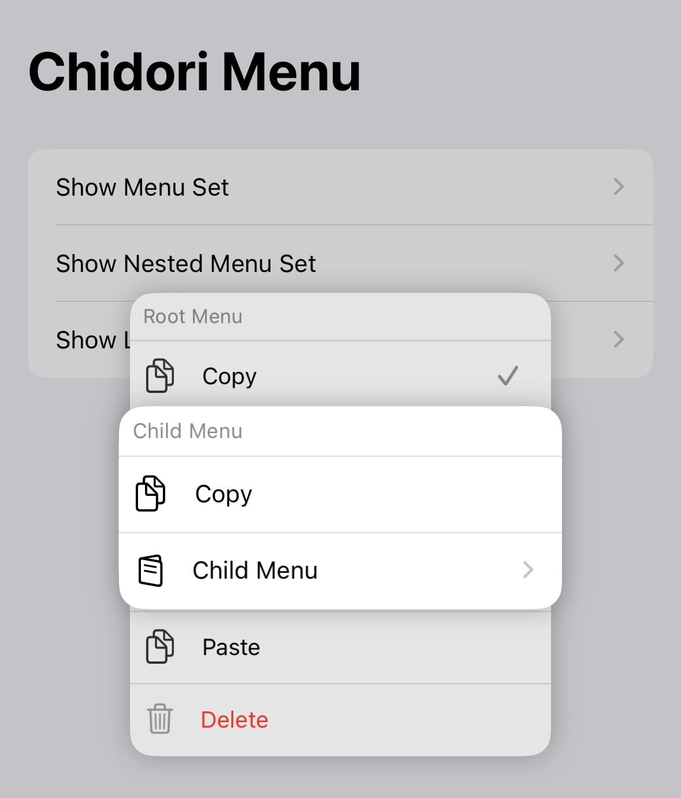

# ChidoriMenu 🐦⚡️

A seamless drop-in replacement for UIMenu & UIAction, featuring nested menu support, dark mode compatibility, and Liquid Glass effects.

The inspiration behind this project stems from Apple's lack of a unified interface across iOS and Mac Catalyst apps, as well as the absence of a built-in menu presentation method. To address these gaps—and to enable greater customization—we developed ChidoriMenu.

This project draws heavily on code from [ChidoriMenu](https://github.com/christianselig/ChidoriMenu), and as such, we adhere to the same license.

## Preview



## Features

- [x] Added support for UIMenu & UIAction
- [x] Added drop-in replacement for `_presentMenuAtLocation:` (not recommended for general use)
- [x] Added support for nested menus in child elements
- [x] Added support for the `.displayInline` menu option
- [x] Added compatibility with dark mode
- [x] Fixed scrolling issues during selection
- [x] Fixed multiple actions triggering simultaneously
- [x] Added support for UIDeferredMenuElement with backward compatibility
- [x] **NEW in 4.0.0**: Liquid Glass blur effects for modern UI aesthetics
- [x] **NEW in 4.0.0**: Improved disabled state handling with consistent alpha management
- [x] **NEW in 4.0.0**: Refactored menu sizing logic for better layout reliability

## Requirements

- iOS 13.0 or later
- macCatalyst 13.0 or later

## Usage

Getting started is straightforward. While the interface differs slightly from Apple's menu implementation, the core principles remain the same. Mac Catalyst is fully supported, though it does not bridge to AppKit menus—it functions identically to iOS.

```swift
UIButton.presentMenu()
UIView.present(menu: menu)
```

For detailed examples, check out the example project included in the repository.

## What's New in 4.0.0

### Liquid Glass Effects
Enable modern blur effects for a premium UI experience:
```swift
ChidoriMenuConfiguration.prefersLiquidGlass = true
```

### Enhanced Disabled State Handling
Improved consistency in disabled menu item appearance with unified alpha management across all UI elements.

### Refactored Menu Sizing
More reliable layout calculations with proper height clamping and width caching for optimal menu presentation.

## Menu Attributes Support

ChidoriMenu provides comprehensive support for UIMenuElement attributes with proper visual feedback and behavior:

### `.disabled` Attribute
- Prevents selection and execution of menu items
- Applies consistent dimmed appearance with alpha reduction
- Works for both actions and submenus

```swift
UIAction(title: "Disabled Action", attributes: .disabled) { _ in
    // This action won't execute
}
```

### `.destructive` Attribute
- Displays actions in red text color for destructive operations
- Can be combined with disabled state for destructive-but-unavailable actions

```swift
UIAction(title: "Delete", attributes: .destructive) { _ in
    // Destructive action
}
```

### `.keepsMenuPresented` Attribute (iOS 16+)
- Action executes without dismissing the menu
- Perfect for toggle switches, counters, and status updates
- Menu automatically refreshes to show updated state

```swift
if #available(iOS 16.0, *) {
    UIAction(title: "Toggle", attributes: [.keepsMenuPresented]) { action in
        action.state = action.state == .on ? .off : .on
    }
}
```

### Combined Attributes
Attributes can be combined for complex scenarios:

```swift
// Disabled destructive action
UIAction(title: "Delete", attributes: [.disabled, .destructive]) { _ in }

// Keeps menu presented with state changes
UIAction(title: "Counter", attributes: [.keepsMenuPresented]) { action in
    let count = Int(action.subtitle ?? "0") ?? 0
    action.subtitle = "\(count + 1)"
}
```

## Compatibility Notes

### UIDeferredMenuElement Support

ChidoriMenu provides full backward compatibility for `UIDeferredMenuElement`, including support for future iOS versions. Starting from iOS 26, Apple removed the `elementProvider` property from `UIDeferredMenuElement`. ChidoriMenu automatically detects this change and dynamically adds the missing functionality through runtime hooking, ensuring your existing code continues to work seamlessly across all iOS versions.

This implementation:
- Hooks the `elementWithProvider:` and `elementWithUncachedProvider:` factory methods
- Dynamically adds the `elementProvider` property when missing
- Maintains proper block lifecycle management
- Works transparently with existing Swift code

## License

ChidoriMenu is available under the MIT license. See the LICENSE file for more info.

---

2025.9.29 - Version 4.0.0 - Made with ❤️ by Lakr233
